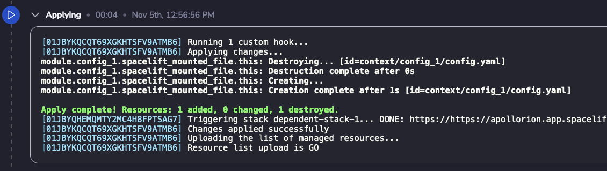

# Plugin Context Trigger

This module adds the `Context Trigger` plugin to your Spacelift account.
It will trigger stacks that are using an explicitly attached context when that context changes.

How it works:
1. Analyzes the after state of an administrative stack.
2. Determines if there are changes to a `spacelift_context`, `spacelift_environment_variable` or `spacelift_mounted_file` (all resources that can effect a context).
3. Determines if that context is explicitly attached with a `spacelift_context_attachment` resource.
4. If the above conditions are all satisfied, if it will the correct stack that is attached via the context attachment and triggers a run against it.

## Usage

1. Spin up the module (see examples below)
2. Add the `trigger_attached_contexts_stacks` label to any administrative stacks that manage contexts and their attachments.
3. When a context changes that is managed by the stack with that label, any stacks using that context will be triggered.

(See below screenshot, under `Apply complete!`)  


## Gotchyas

Theres a few things to keep in mind when using this plugin.
1. The plugin only works in `administrative` stacks.
2. The plugin does **not** work with autoattached contexts, the context **must** be attached with a `spacelift_context_attachment` resource.
3. If the stack id, or context id is unknown until after apply, the plugin will not work. This is because the plugin needs to know the stack id and context id to trigger the stack.
  - This limitation may change in the future.

<!-- BEGIN_TF_DOCS -->
## Example

```hcl
module "ec2_worker_pool_stack" {
  source = "spacelift.io/spacelift-solutions/plugin-context-trigger/spacelift"

  # Required Variables
  spacelift_domain = "https://spacelift-solutions.app.spacelift.io"

  # Optional Variables
  name     = "plugin-context-trigger"
  space_id = "root"
}
```

## Inputs

| Name | Description | Type | Default | Required |
|------|-------------|------|---------|:--------:|
| <a name="input_name"></a> [name](#input\_name) | Name of the context | `string` | `"plugin-context-trigger"` | no |
| <a name="input_space_id"></a> [space\_id](#input\_space\_id) | ID of the space | `string` | `"root"` | no |
| <a name="input_spacelift_domain"></a> [spacelift\_domain](#input\_spacelift\_domain) | fqdn of the spacelift instance (https://spacelift-solutions.app.spacelift.io) | `string` | n/a | yes |

## Outputs

No outputs.  
<!-- END_TF_DOCS -->
